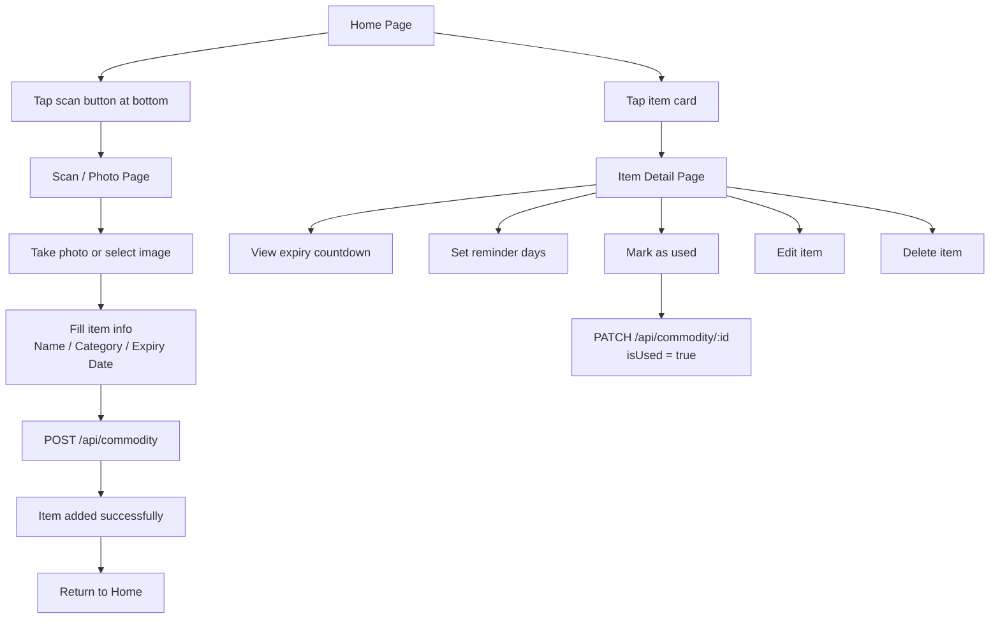
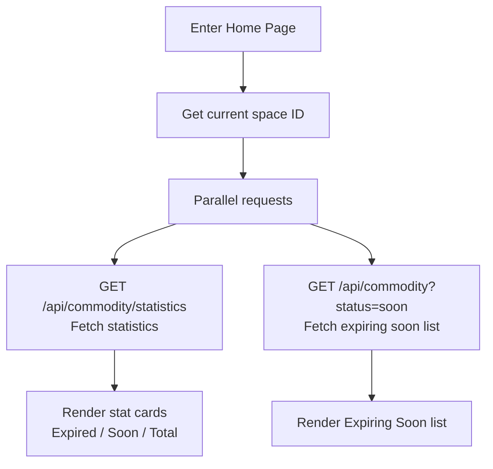
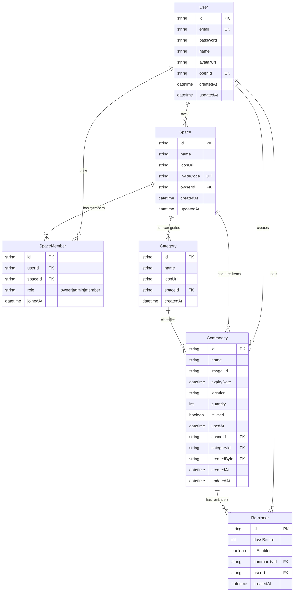
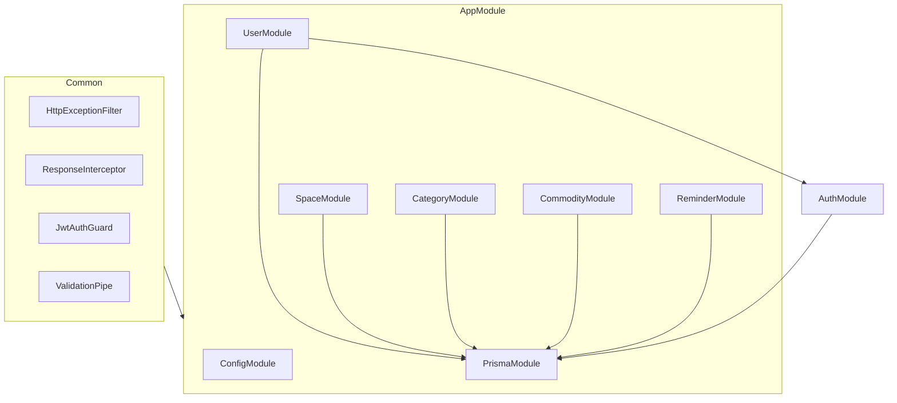

# Bell — Home Inventory System Design Document

## 1. Project Overview

Bell is a WeChat Mini Program that helps users manage household item expiry dates. Users can create "Spaces" (e.g., kitchen, fridge), add items within spaces, and track their expiration status. Multi-user collaboration is supported.

| Item | Technology |
|------|-----------|
| Frontend | Taro 4 + React 18 + Redux Toolkit + TailwindCSS |
| Backend | NestJS 11 + Prisma 7 + SQLite |
| Platform | WeChat Mini Program |
| Auth | WeChat Login + JWT |

## 2. Core Business Flows

### 2.1 User Authentication Flow

```mermaid
flowchart TD
    A[Open Mini Program] --> B{Already logged in?}
    B -->|Yes| C[Enter Home]
    B -->|No| D[Show Login Page]
    D --> E[Tap "WeChat Quick Login"]
    D --> F[Tap "Skip"]
    E --> G[WeChat auth returns code]
    G --> H[POST /api/user/signin<br/>Send code to backend]
    H --> I[Backend exchanges code for openId]
    I --> J{User exists?}
    J -->|Yes| K[Generate JWT Token]
    J -->|No| L[Auto-create user]
    L --> K
    K --> C
    F --> C
```

### 2.2 Space Management Flow

```mermaid
flowchart TD
    A[Settings — My Spaces] --> B[Tap Manage]
    B --> C[Spaces List Page]
    C --> D[Tap "Create New Space"]
    D --> E[Enter space name]
    E --> F[POST /api/space]
    F --> G[Generate invite code]
    G --> H[Space Created Page<br/>Display invite code]
    H --> I[Copy / Share code]

    C --> J[Tap a space]
    J --> K[Space Detail Page]
    K --> L[View member list]
    K --> M[Invite new member]
    K --> N[Switch to this space]
    K --> O[Delete space]

    M --> P[Other user enters invite code]
    P --> Q[POST /api/space/join]
    Q --> R[Joined space successfully]
```

### 2.3 Item Management Flow



### 2.4 Home Page Data Loading Flow



## 3. Page Structure

| Page | Path | Description | Auth |
|------|------|-------------|------|
| Home | `/pages/tabs/home` | Stats dashboard + expiring soon list + scan entry | Optional |
| List | `/pages/tabs/list` | All items list with search/filter/sort | Optional |
| Settings | `/pages/tabs/settings` | Login/logout, space management, app settings | Optional |
| Login | `/pages/inner/signin` | WeChat quick login | No |
| Scan & Add | `/pages/inner/scanner` | Photo + fill item info | Yes |
| Item Detail | `/pages/inner/commodity` | Expiry countdown, reminder settings, mark used | Yes |
| Spaces List | `/pages/inner/spaces` | Manage all spaces | Yes |
| Space Detail | `/pages/inner/space-detail` | Invite code, members, switch/delete space | Yes |
| Space Created | `/pages/inner/space-created` | Display invite code, copy/share | Yes |

## 4. API Endpoint Design

### 4.1 Authentication

| Method | Path | Description | Auth |
|--------|------|-------------|------|
| POST | `/api/user/signin` | WeChat login (code → token) | No |

### 4.2 User

| Method | Path | Description | Auth |
|--------|------|-------------|------|
| GET | `/api/user/profile` | Get current user info | Yes |
| PATCH | `/api/user/profile` | Update user info | Yes |

### 4.3 Space

| Method | Path | Description | Auth |
|--------|------|-------------|------|
| POST | `/api/space` | Create space | Yes |
| GET | `/api/space` | Get my spaces list | Yes |
| GET | `/api/space/:id` | Get space detail (with members) | Yes |
| PATCH | `/api/space/:id` | Update space info | Yes |
| DELETE | `/api/space/:id` | Delete space (owner only) | Yes |
| POST | `/api/space/join` | Join space via invite code | Yes |
| DELETE | `/api/space/:id/member/:userId` | Remove member | Yes |

### 4.4 Category

| Method | Path | Description | Auth |
|--------|------|-------------|------|
| POST | `/api/category` | Create category | Yes |
| GET | `/api/category?spaceId=xxx` | Get categories in a space | Yes |
| DELETE | `/api/category/:id` | Delete category | Yes |

### 4.5 Commodity (Item)

| Method | Path | Description | Auth |
|--------|------|-------------|------|
| POST | `/api/commodity` | Add item | Yes |
| GET | `/api/commodity` | Query items (filter/sort supported) | Yes |
| GET | `/api/commodity/statistics` | Get statistics | Yes |
| GET | `/api/commodity/:id` | Get item detail | Yes |
| PATCH | `/api/commodity/:id` | Update item | Yes |
| DELETE | `/api/commodity/:id` | Delete item | Yes |

### 4.6 Reminder

| Method | Path | Description | Auth |
|--------|------|-------------|------|
| PUT | `/api/reminder` | Set/update reminder | Yes |
| GET | `/api/reminder?commodityId=xxx` | Get reminder settings for an item | Yes |

### 4.7 Unified Response Format

Success:
```json
{ "code": 200, "message": "success", "data": { ... } }
```

Failure:
```json
{ "code": 400, "message": "Specific error message", "data": null }
```

## 5. Data Model

### 5.1 ER Diagram



### 5.2 Table Field Descriptions

#### User

| Field | Type | Constraint | Description |
|-------|------|-----------|-------------|
| id | String | PK, UUID | Primary key |
| email | String | UNIQUE | Email address |
| password | String | | Password (bcrypt hashed) |
| name | String? | | Display name |
| avatarUrl | String? | | Avatar URL |
| openId | String? | UNIQUE | WeChat OpenID |
| createdAt | DateTime | | Created at |
| updatedAt | DateTime | | Updated at |

#### Space

| Field | Type | Constraint | Description |
|-------|------|-----------|-------------|
| id | String | PK, UUID | Primary key |
| name | String | | Space name |
| iconUrl | String? | | Icon URL |
| inviteCode | String | UNIQUE | Invite code (e.g., HEM-829-X) |
| ownerId | String | FK → User | Owner |
| createdAt | DateTime | | Created at |
| updatedAt | DateTime | | Updated at |

#### SpaceMember

| Field | Type | Constraint | Description |
|-------|------|-----------|-------------|
| id | String | PK, UUID | Primary key |
| userId | String | FK → User | User |
| spaceId | String | FK → Space | Space |
| role | String | Default "member" | Role: owner / admin / member |
| joinedAt | DateTime | | Joined at |

> Unique constraint: (userId, spaceId)

#### Category

| Field | Type | Constraint | Description |
|-------|------|-----------|-------------|
| id | String | PK, UUID | Primary key |
| name | String | | Category name |
| iconUrl | String? | | Icon URL |
| spaceId | String | FK → Space | Belongs to space |
| createdAt | DateTime | | Created at |

> Unique constraint: (name, spaceId)

#### Commodity (Item)

| Field | Type | Constraint | Description |
|-------|------|-----------|-------------|
| id | String | PK, UUID | Primary key |
| name | String | | Item name |
| imageUrl | String? | | Image URL |
| expiryDate | DateTime | | Expiry date |
| location | String? | | Storage location |
| quantity | Int | Default 1 | Quantity |
| isUsed | Boolean | Default false | Whether marked as used |
| usedAt | DateTime? | | Marked used at |
| spaceId | String | FK → Space | Belongs to space |
| categoryId | String? | FK → Category | Belongs to category |
| createdById | String | FK → User | Created by |
| createdAt | DateTime | | Created at |
| updatedAt | DateTime | | Updated at |

#### Reminder

| Field | Type | Constraint | Description |
|-------|------|-----------|-------------|
| id | String | PK, UUID | Primary key |
| daysBefore | Int | Default 2 | Days before expiry to remind |
| isEnabled | Boolean | Default true | Whether enabled |
| commodityId | String | FK → Commodity | Item |
| userId | String | FK → User | User |
| createdAt | DateTime | | Created at |

> Unique constraint: (commodityId, userId)

## 6. Backend Module Structure



```
apps/back-end/src/
├── common/                  # Shared modules
│   ├── decorators/          # Custom decorators
│   ├── dto/                 # Shared DTOs
│   ├── filters/             # Exception filters
│   ├── guards/              # Auth guards
│   ├── interceptors/        # Response interceptors
│   └── interfaces/          # Shared interfaces
├── config/                  # Configuration
│   ├── api-doc.ts
│   └── logger.ts
├── modules/                 # Business modules
│   ├── auth/                # Auth (JWT strategy, no standalone routes)
│   ├── user/                # User (includes signin endpoint)
│   ├── space/               # Space management
│   ├── category/            # Category management
│   ├── commodity/           # Item management
│   └── reminder/            # Reminder management
├── prisma/                  # Prisma service
├── app.module.ts
└── main.ts
```
