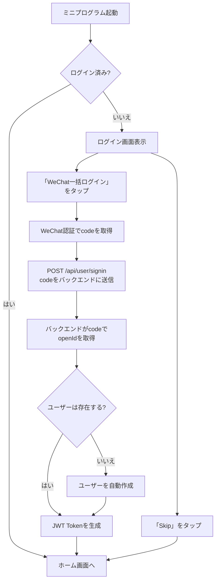
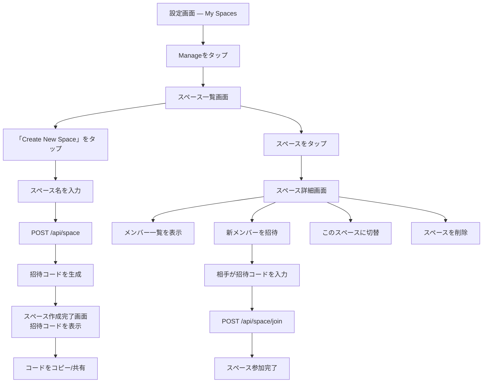
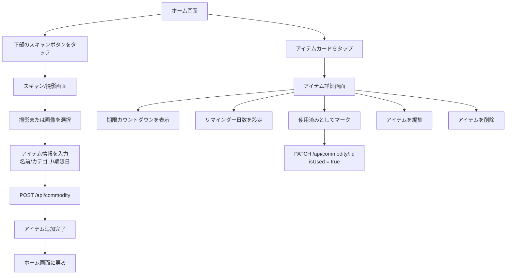
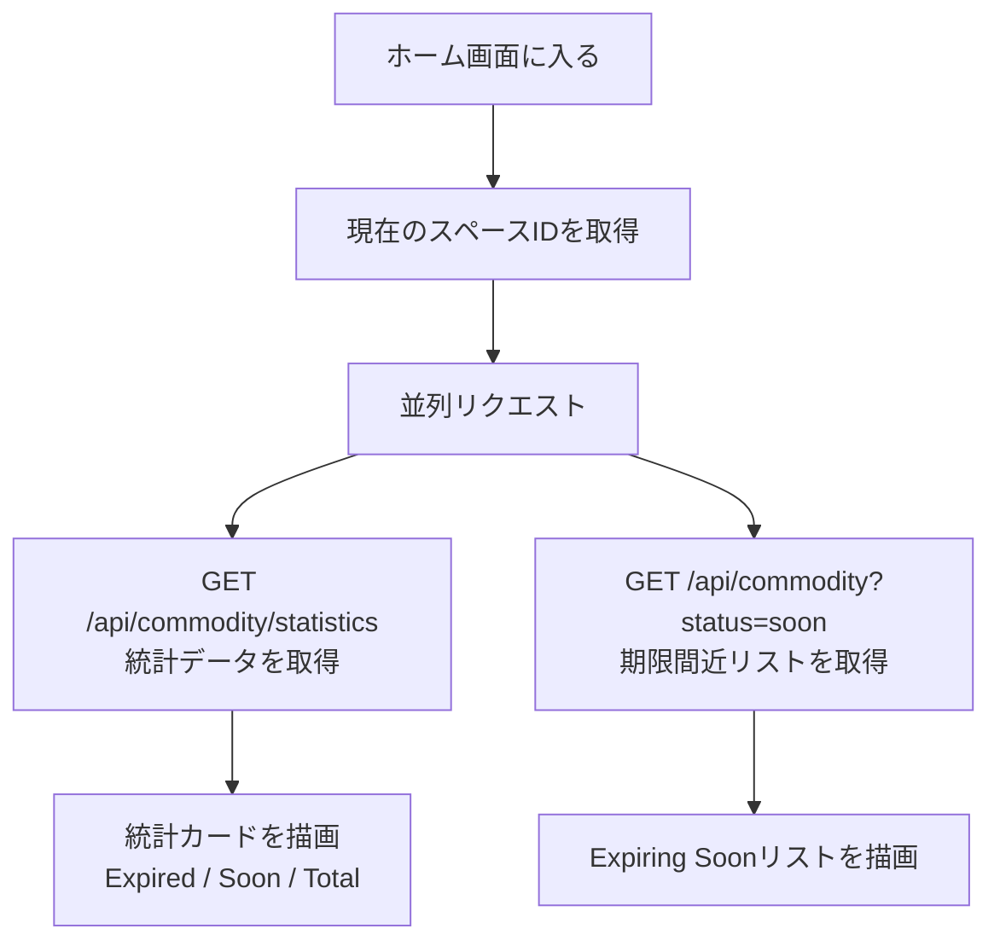
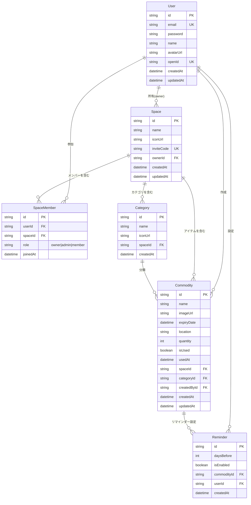
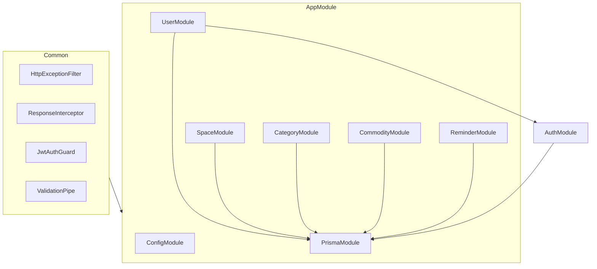

# Bell — 家物リスト システム設計書

## 1. プロジェクト概要

Bell（家物リスト）は、家庭用品の賞味期限を管理するWeChatミニプログラムです。ユーザーは「スペース」（キッチン、冷蔵庫など）を作成し、スペース内にアイテムを追加して期限切れ状態を追跡できます。複数人での共同管理に対応しています。

| 項目 | 技術選定 |
|------|---------|
| フロントエンド | Taro 4 + React 18 + Redux Toolkit + TailwindCSS |
| バックエンド | NestJS 11 + Prisma 7 + SQLite |
| プラットフォーム | WeChatミニプログラム |
| 認証 | WeChatログイン + JWT |

## 2. コアビジネスフロー

### 2.1 ユーザー認証フロー



### 2.2 スペース管理フロー



### 2.3 アイテム管理フロー



### 2.4 ホーム画面データ読み込みフロー



## 3. 画面構成

| 画面 | パス | 説明 | 認証 |
|------|------|------|------|
| ホーム | `/pages/tabs/home` | 統計ダッシュボード + 期限間近リスト + スキャン入口 | 任意 |
| リスト | `/pages/tabs/list` | 全アイテム一覧、検索/フィルター/ソート対応 | 任意 |
| 設定 | `/pages/tabs/settings` | ログイン/ログアウト、スペース管理、アプリ設定 | 任意 |
| ログイン | `/pages/inner/signin` | WeChat一括ログイン | 不要 |
| スキャン追加 | `/pages/inner/scanner` | 撮影 + アイテム情報入力 | 必要 |
| アイテム詳細 | `/pages/inner/commodity` | 期限カウントダウン、リマインダー設定、使用済みマーク | 必要 |
| スペース一覧 | `/pages/inner/spaces` | 全スペースの管理 | 必要 |
| スペース詳細 | `/pages/inner/space-detail` | 招待コード、メンバー、切替/削除 | 必要 |
| スペース作成完了 | `/pages/inner/space-created` | 招待コード表示、コピー/共有 | 必要 |

## 4. APIエンドポイント設計

### 4.1 認証

| メソッド | パス | 説明 | 認証 |
|---------|------|------|------|
| POST | `/api/user/signin` | WeChatログイン（code → token） | 不要 |

### 4.2 ユーザー

| メソッド | パス | 説明 | 認証 |
|---------|------|------|------|
| GET | `/api/user/profile` | 現在のユーザー情報を取得 | 必要 |
| PATCH | `/api/user/profile` | ユーザー情報を更新 | 必要 |

### 4.3 スペース

| メソッド | パス | 説明 | 認証 |
|---------|------|------|------|
| POST | `/api/space` | スペースを作成 | 必要 |
| GET | `/api/space` | 自分のスペース一覧を取得 | 必要 |
| GET | `/api/space/:id` | スペース詳細を取得（メンバー含む） | 必要 |
| PATCH | `/api/space/:id` | スペース情報を更新 | 必要 |
| DELETE | `/api/space/:id` | スペースを削除（オーナーのみ） | 必要 |
| POST | `/api/space/join` | 招待コードでスペースに参加 | 必要 |
| DELETE | `/api/space/:id/member/:userId` | メンバーを削除 | 必要 |

### 4.4 カテゴリ

| メソッド | パス | 説明 | 認証 |
|---------|------|------|------|
| POST | `/api/category` | カテゴリを作成 | 必要 |
| GET | `/api/category?spaceId=xxx` | スペース内のカテゴリを取得 | 必要 |
| DELETE | `/api/category/:id` | カテゴリを削除 | 必要 |

### 4.5 アイテム

| メソッド | パス | 説明 | 認証 |
|---------|------|------|------|
| POST | `/api/commodity` | アイテムを追加 | 必要 |
| GET | `/api/commodity` | アイテム一覧を取得（フィルター/ソート対応） | 必要 |
| GET | `/api/commodity/statistics` | 統計データを取得 | 必要 |
| GET | `/api/commodity/:id` | アイテム詳細を取得 | 必要 |
| PATCH | `/api/commodity/:id` | アイテムを更新 | 必要 |
| DELETE | `/api/commodity/:id` | アイテムを削除 | 必要 |

### 4.6 リマインダー

| メソッド | パス | 説明 | 認証 |
|---------|------|------|------|
| PUT | `/api/reminder` | リマインダーを設定/更新 | 必要 |
| GET | `/api/reminder?commodityId=xxx` | アイテムのリマインダー設定を取得 | 必要 |

### 4.7 統一レスポンス形式

成功：
```json
{ "code": 200, "message": "success", "data": { ... } }
```

失敗：
```json
{ "code": 400, "message": "具体的なエラーメッセージ", "data": null }
```

## 5. データモデル

### 5.1 ER関係図



### 5.2 テーブルフィールド説明

#### User（ユーザー）

| フィールド | 型 | 制約 | 説明 |
|-----------|------|------|------|
| id | String | PK, UUID | 主キー |
| email | String | UNIQUE | メールアドレス |
| password | String | | パスワード（bcryptハッシュ） |
| name | String? | | ユーザー名 |
| avatarUrl | String? | | アバターURL |
| openId | String? | UNIQUE | WeChat OpenID |
| createdAt | DateTime | | 作成日時 |
| updatedAt | DateTime | | 更新日時 |

#### Space（スペース）

| フィールド | 型 | 制約 | 説明 |
|-----------|------|------|------|
| id | String | PK, UUID | 主キー |
| name | String | | スペース名 |
| iconUrl | String? | | アイコンURL |
| inviteCode | String | UNIQUE | 招待コード（例：HEM-829-X） |
| ownerId | String | FK → User | オーナー |
| createdAt | DateTime | | 作成日時 |
| updatedAt | DateTime | | 更新日時 |

#### SpaceMember（スペースメンバー）

| フィールド | 型 | 制約 | 説明 |
|-----------|------|------|------|
| id | String | PK, UUID | 主キー |
| userId | String | FK → User | ユーザー |
| spaceId | String | FK → Space | スペース |
| role | String | デフォルト "member" | 役割：owner / admin / member |
| joinedAt | DateTime | | 参加日時 |

> ユニーク制約：(userId, spaceId)

#### Category（カテゴリ）

| フィールド | 型 | 制約 | 説明 |
|-----------|------|------|------|
| id | String | PK, UUID | 主キー |
| name | String | | カテゴリ名 |
| iconUrl | String? | | アイコンURL |
| spaceId | String | FK → Space | 所属スペース |
| createdAt | DateTime | | 作成日時 |

> ユニーク制約：(name, spaceId)

#### Commodity（アイテム）

| フィールド | 型 | 制約 | 説明 |
|-----------|------|------|------|
| id | String | PK, UUID | 主キー |
| name | String | | アイテム名 |
| imageUrl | String? | | 画像URL |
| expiryDate | DateTime | | 期限日 |
| location | String? | | 保管場所 |
| quantity | Int | デフォルト 1 | 数量 |
| isUsed | Boolean | デフォルト false | 使用済みか |
| usedAt | DateTime? | | 使用済みマーク日時 |
| spaceId | String | FK → Space | 所属スペース |
| categoryId | String? | FK → Category | 所属カテゴリ |
| createdById | String | FK → User | 作成者 |
| createdAt | DateTime | | 作成日時 |
| updatedAt | DateTime | | 更新日時 |

#### Reminder（リマインダー）

| フィールド | 型 | 制約 | 説明 |
|-----------|------|------|------|
| id | String | PK, UUID | 主キー |
| daysBefore | Int | デフォルト 2 | 何日前にリマインド |
| isEnabled | Boolean | デフォルト true | 有効か |
| commodityId | String | FK → Commodity | アイテム |
| userId | String | FK → User | ユーザー |
| createdAt | DateTime | | 作成日時 |

> ユニーク制約：(commodityId, userId)

## 6. バックエンドモジュール構成



```
apps/back-end/src/
├── common/                  # 共通モジュール
│   ├── decorators/          # カスタムデコレータ
│   ├── dto/                 # 共通DTO
│   ├── filters/             # 例外フィルター
│   ├── guards/              # 認証ガード
│   ├── interceptors/        # レスポンスインターセプター
│   └── interfaces/          # 共通インターフェース
├── config/                  # 設定
│   ├── api-doc.ts
│   └── logger.ts
├── modules/                 # ビジネスモジュール
│   ├── auth/                # 認証（JWT戦略、独立ルートなし）
│   ├── user/                # ユーザー（ログインエンドポイント含む）
│   ├── space/               # スペース管理
│   ├── category/            # カテゴリ管理
│   ├── commodity/           # アイテム管理
│   └── reminder/            # リマインダー管理
├── prisma/                  # Prismaサービス
├── app.module.ts
└── main.ts
```
