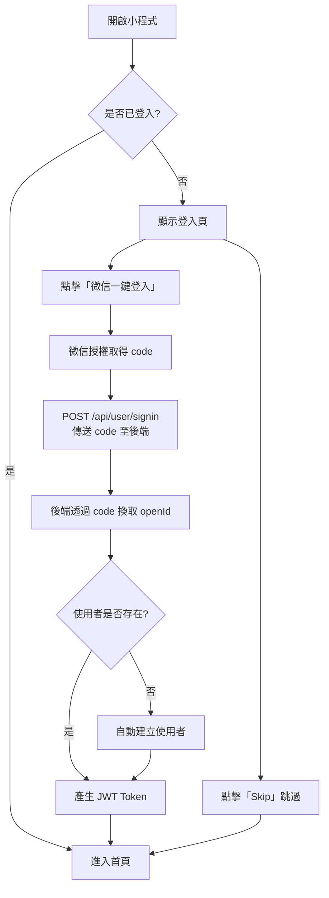
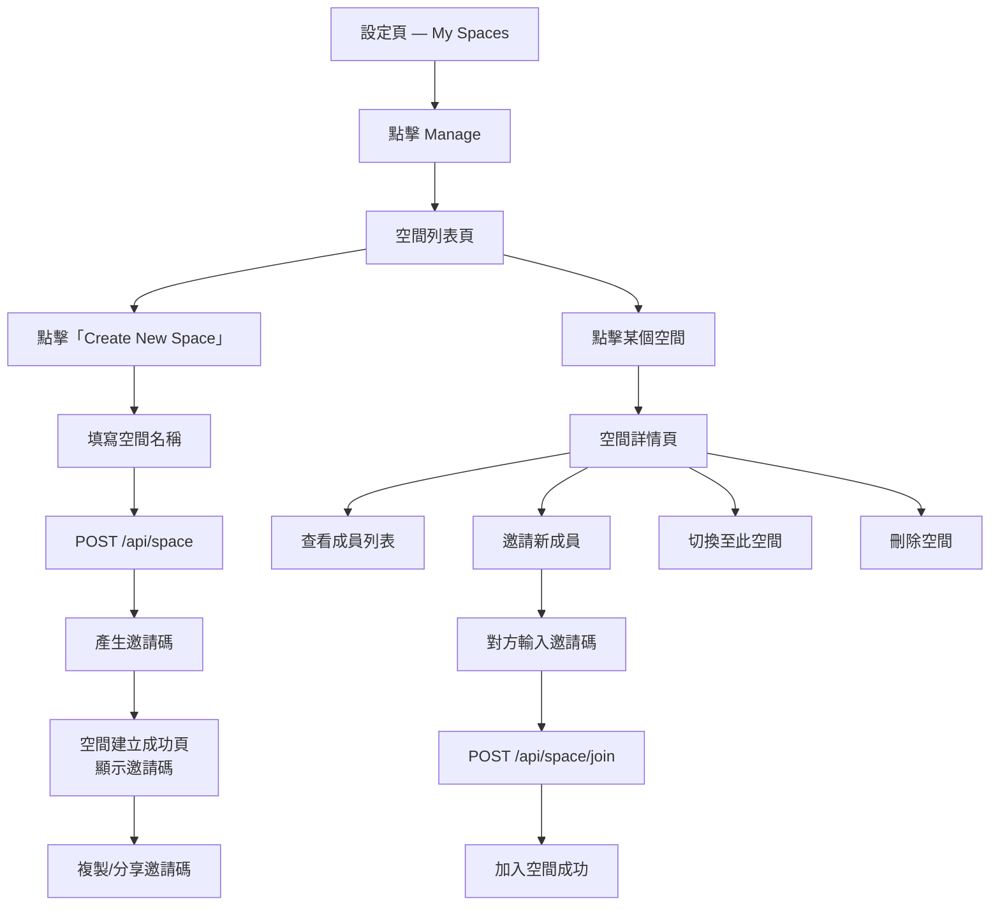
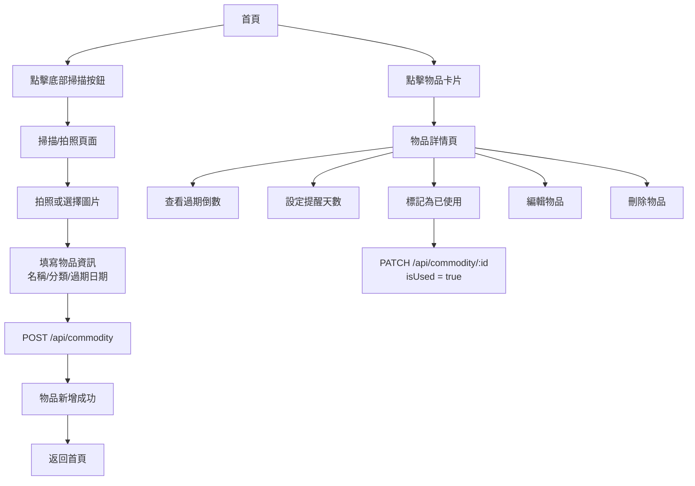
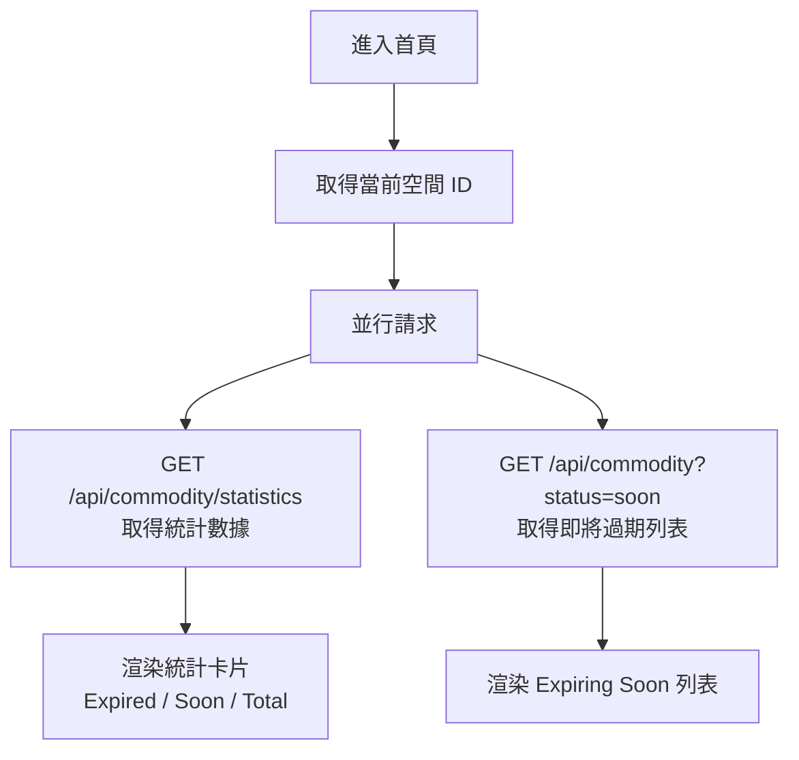
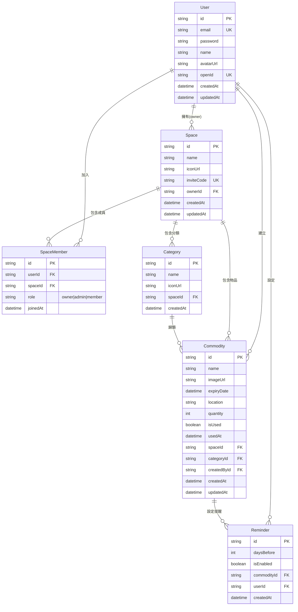
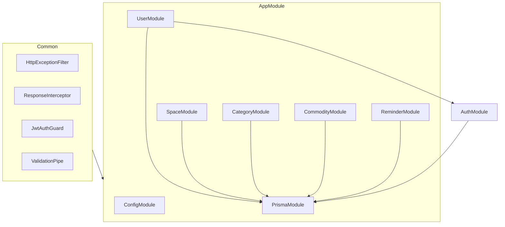

# Bell — 家物清單 系統設計文件

## 1. 專案概述

Bell（家物清單）是一款微信小程式，幫助使用者管理家庭物品的保質期。使用者可以建立「空間」（如廚房、冰箱），在空間中新增物品並追蹤其過期狀態，支援多人協作管理。

| 項目 | 技術選型 |
|------|---------|
| 前端 | Taro 4 + React 18 + Redux Toolkit + TailwindCSS |
| 後端 | NestJS 11 + Prisma 7 + SQLite |
| 平台 | 微信小程式 |
| 認證 | 微信登入 + JWT |

## 2. 核心業務流程

### 2.1 使用者認證流程



### 2.2 空間管理流程



### 2.3 物品管理流程



### 2.4 首頁資料載入流程



## 3. 頁面結構

| 頁面 | 路徑 | 說明 | 認證 |
|------|------|------|------|
| 首頁 | `/pages/tabs/home` | 統計面板 + 即將過期列表 + 掃描入口 | 可選 |
| 列表 | `/pages/tabs/list` | 全部物品列表，支援搜尋/篩選/排序 | 可選 |
| 設定 | `/pages/tabs/settings` | 登入/登出、空間管理、應用設定 | 可選 |
| 登入 | `/pages/inner/signin` | 微信一鍵登入 | 否 |
| 掃描新增 | `/pages/inner/scanner` | 拍照 + 填寫物品資訊 | 是 |
| 物品詳情 | `/pages/inner/commodity` | 過期倒數、提醒設定、標記使用 | 是 |
| 空間列表 | `/pages/inner/spaces` | 管理所有空間 | 是 |
| 空間詳情 | `/pages/inner/space-detail` | 邀請碼、成員、切換/刪除空間 | 是 |
| 空間建立成功 | `/pages/inner/space-created` | 顯示邀請碼，複製/分享 | 是 |

## 4. API 端點設計

### 4.1 認證

| 方法 | 路徑 | 說明 | 認證 |
|------|------|------|------|
| POST | `/api/user/signin` | 微信登入（code 換 token） | 否 |

### 4.2 使用者

| 方法 | 路徑 | 說明 | 認證 |
|------|------|------|------|
| GET | `/api/user/profile` | 取得當前使用者資訊 | 是 |
| PATCH | `/api/user/profile` | 更新使用者資訊 | 是 |

### 4.3 空間

| 方法 | 路徑 | 說明 | 認證 |
|------|------|------|------|
| POST | `/api/space` | 建立空間 | 是 |
| GET | `/api/space` | 取得我的空間列表 | 是 |
| GET | `/api/space/:id` | 取得空間詳情（含成員） | 是 |
| PATCH | `/api/space/:id` | 更新空間資訊 | 是 |
| DELETE | `/api/space/:id` | 刪除空間（僅擁有者） | 是 |
| POST | `/api/space/join` | 透過邀請碼加入空間 | 是 |
| DELETE | `/api/space/:id/member/:userId` | 移除成員 | 是 |

### 4.4 分類

| 方法 | 路徑 | 說明 | 認證 |
|------|------|------|------|
| POST | `/api/category` | 建立分類 | 是 |
| GET | `/api/category?spaceId=xxx` | 取得空間下的分類 | 是 |
| DELETE | `/api/category/:id` | 刪除分類 | 是 |

### 4.5 物品

| 方法 | 路徑 | 說明 | 認證 |
|------|------|------|------|
| POST | `/api/commodity` | 新增物品 | 是 |
| GET | `/api/commodity` | 查詢物品列表（支援篩選/排序） | 是 |
| GET | `/api/commodity/statistics` | 取得統計數據 | 是 |
| GET | `/api/commodity/:id` | 取得物品詳情 | 是 |
| PATCH | `/api/commodity/:id` | 更新物品 | 是 |
| DELETE | `/api/commodity/:id` | 刪除物品 | 是 |

### 4.6 提醒

| 方法 | 路徑 | 說明 | 認證 |
|------|------|------|------|
| PUT | `/api/reminder` | 設定/更新提醒 | 是 |
| GET | `/api/reminder?commodityId=xxx` | 取得物品的提醒設定 | 是 |

### 4.7 統一回應格式

成功：
```json
{ "code": 200, "message": "success", "data": { ... } }
```

失敗：
```json
{ "code": 400, "message": "具體錯誤訊息", "data": null }
```

## 5. 資料模型

### 5.1 ER 關係圖



### 5.2 資料表欄位說明

#### User（使用者）

| 欄位 | 類型 | 約束 | 說明 |
|------|------|------|------|
| id | String | PK, UUID | 主鍵 |
| email | String | UNIQUE | 電子郵件 |
| password | String | | 密碼（bcrypt 雜湊） |
| name | String? | | 使用者名稱 |
| avatarUrl | String? | | 頭像 URL |
| openId | String? | UNIQUE | 微信 OpenID |
| createdAt | DateTime | | 建立時間 |
| updatedAt | DateTime | | 更新時間 |

#### Space（空間）

| 欄位 | 類型 | 約束 | 說明 |
|------|------|------|------|
| id | String | PK, UUID | 主鍵 |
| name | String | | 空間名稱 |
| iconUrl | String? | | 圖示 URL |
| inviteCode | String | UNIQUE | 邀請碼（如 HEM-829-X） |
| ownerId | String | FK → User | 擁有者 |
| createdAt | DateTime | | 建立時間 |
| updatedAt | DateTime | | 更新時間 |

#### SpaceMember（空間成員）

| 欄位 | 類型 | 約束 | 說明 |
|------|------|------|------|
| id | String | PK, UUID | 主鍵 |
| userId | String | FK → User | 使用者 |
| spaceId | String | FK → Space | 空間 |
| role | String | 預設 "member" | 角色：owner / admin / member |
| joinedAt | DateTime | | 加入時間 |

> 唯一約束：(userId, spaceId)

#### Category（分類）

| 欄位 | 類型 | 約束 | 說明 |
|------|------|------|------|
| id | String | PK, UUID | 主鍵 |
| name | String | | 分類名稱 |
| iconUrl | String? | | 圖示 URL |
| spaceId | String | FK → Space | 所屬空間 |
| createdAt | DateTime | | 建立時間 |

> 唯一約束：(name, spaceId)

#### Commodity（物品）

| 欄位 | 類型 | 約束 | 說明 |
|------|------|------|------|
| id | String | PK, UUID | 主鍵 |
| name | String | | 物品名稱 |
| imageUrl | String? | | 圖片 URL |
| expiryDate | DateTime | | 過期日期 |
| location | String? | | 存放位置 |
| quantity | Int | 預設 1 | 數量 |
| isUsed | Boolean | 預設 false | 是否已使用 |
| usedAt | DateTime? | | 標記使用時間 |
| spaceId | String | FK → Space | 所屬空間 |
| categoryId | String? | FK → Category | 所屬分類 |
| createdById | String | FK → User | 建立者 |
| createdAt | DateTime | | 建立時間 |
| updatedAt | DateTime | | 更新時間 |

#### Reminder（提醒）

| 欄位 | 類型 | 約束 | 說明 |
|------|------|------|------|
| id | String | PK, UUID | 主鍵 |
| daysBefore | Int | 預設 2 | 提前幾天提醒 |
| isEnabled | Boolean | 預設 true | 是否啟用 |
| commodityId | String | FK → Commodity | 物品 |
| userId | String | FK → User | 使用者 |
| createdAt | DateTime | | 建立時間 |

> 唯一約束：(commodityId, userId)

## 6. 後端模組結構



```
apps/back-end/src/
├── common/                  # 通用模組
│   ├── decorators/          # 自訂裝飾器
│   ├── dto/                 # 通用 DTO
│   ├── filters/             # 異常過濾器
│   ├── guards/              # 認證守衛
│   ├── interceptors/        # 回應攔截器
│   └── interfaces/          # 通用介面
├── config/                  # 設定
│   ├── api-doc.ts
│   └── logger.ts
├── modules/                 # 業務模組
│   ├── auth/                # 認證（JWT 策略，無獨立路由）
│   ├── user/                # 使用者（含登入端點）
│   ├── space/               # 空間管理
│   ├── category/            # 分類管理
│   ├── commodity/           # 物品管理
│   └── reminder/            # 提醒管理
├── prisma/                  # Prisma 服務
├── app.module.ts
└── main.ts
```
